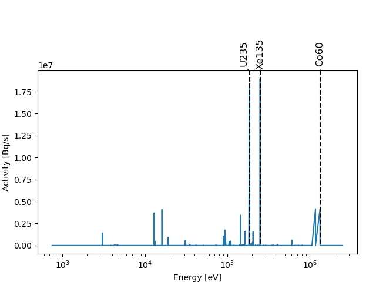

[](https://github.com/fusion-energy/openmc_source_plotter/actions/workflows/ci_with_install.yml)

[](https://github.com/fusion-energy/openmc_source_plotter/actions/workflows/python-publish.yml)

A Python package for plotting the positions, directions or energy distributions of OpenMC sources.

# Installation

You will need to have OpenMC version 0.14.0 or newer installed first.

```bash
pip install openmc_source_plotter
```

# Features

The package simply extends the default ```openmc.IndependentSourceBase``` and ```openmc.Model``` to provides additional functions that:

- extract the positions, directions and energy of particles
- visualise a source with respect to:
  - direction
  - energy
  - position

Or just provide the initial particles with ```sample_initial_particles```

# Example plots

Below are some basic examples, for more examples see the [examples folder](https://github.com/fusion-energy/openmc_source_plotter/tree/main/examples) for example usage scripts.


## Plot of energy distribution of the source

:link:[Link](https://github.com/fusion-energy/openmc_source_plotter/blob/main/examples/example_plot_source_energy.py) to example script.


## Plot of energy distribution of two sources

:link:[Link](https://github.com/fusion-energy/openmc_source_plotter/blob/main/examples/example_plot_two_source_energies.py) to example script.


## Plot direction of particles

:link:[Link](https://github.com/fusion-energy/openmc_source_plotter/blob/main/examples/example_plot_source_direction.py) to example script.


## Plot position of particles

:link:[Link](https://github.com/fusion-energy/openmc_source_plotter/blob/main/examples/example_plot_source_position.py) to example script.


## Plot labeled gamma lines from material

:link:[Link](https://github.com/fusion-energy/openmc_source_plotter/blob/main/examples/example_gamma_spec_plot.py) to example script.




## Extract particle objects

A list of ```openmc.Particle``` objects can be obtained using ```model.sample_initial_particles()``` or ```openmc.SourceBase.sample_initial_particles()```

```python
import openmc
import openmc_source_plotter  # extents openmc.Model with sample_initial_particles method

settings = openmc.Settings()
settings.particles = 1
settings.batches = 1
my_source = openmc.IndependentSource()
my_source.energy = openmc.stats.muir(e0=14080000.0, m_rat=5.0, kt=20000.0)
settings.source = my_source
materials = openmc.Materials()
sph = openmc.Sphere(r=100, boundary_type="vacuum")
cell = openmc.Cell(region=-sph)
geometry = openmc.Geometry([cell])

model = openmc.Model(geometry, materials, settings)

particles = model.sample_initial_particles(n_samples=10)

print(particles)
>>>[<SourceParticle: neutron at E=1.440285e+07 eV>, <SourceParticle: neutron at E=1.397691e+07 eV>, <SourceParticle: neutron at E=1.393681e+07 eV>, <SourceParticle: neutron at E=1.470896e+07 eV>, <SourceParticle: neutron at E=1.460563e+07 eV>, <SourceParticle: neutron at E=1.420684e+07 eV>, <SourceParticle: neutron at E=1.413932e+07 eV>, <SourceParticle: neutron at E=1.412428e+07 eV>, <SourceParticle: neutron at E=1.464779e+07 eV>, <SourceParticle: neutron at E=1.391648e+07 eV>]

print(particles[0].E)
>>>1.440285e+07
```

## Related packages

Tokamak sources can also be plotted using the [openmc-plasma-source](https://github.com/fusion-energy/openmc-plasma-source) package


